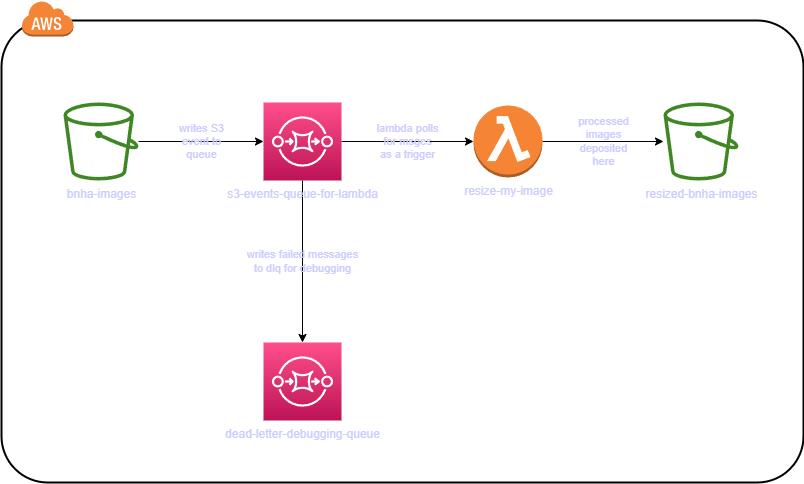

# Welcome to a smoll little Terraform project
The following mini project is one that I decided to start just to test out some of the basics I learnt from Terraform thus far. There are definitely lots of templates out there but I just wanted to try building a simple project based on stuff I learnt from a recent course I took! 

Be warned that this project is made by an absolute beginner and might invoke unpleasant symptoms such as the vomiting of bl**d. Viewer discretion is advised.

## Overview
This project aims to set up a simple serverless image resizing pipeline using AWS services and Terraform. The pipeline involves the uploading of images to an ingestion S3 bucket, which in turn writes S3 PUT event notifications to an SQS queue. Said SQS will have an event mapping set up with the lambda used for processing, wherein this lambda will poll from the SQS queue for messages to get information on the S3 object to process on and write to an output bucket. Essentially, SQS will serve as a means to trigger the lambda function and also helps with decoupling the rate of S3 PUT events firing off lambdas.

Note that lambda can directly be triggered by S3, and that lambda itself has a means to throttle should the number of messages being triggered exceeed the limit (1000 concurrent lambdas for the region I am using). However, I do like this method of having an SQS queue to act as a buffer, especially in a pipeline where there are many other lambda functions working concurrently. This gives me an easy means to control the concurrencies of each core lambda feature, and with the usage of DLQs, an easy way to refire all failed messages (after some debugging of errors) at one go. There are most definitely other methods out there, this is perhaps just one of them!


## Architecture Diagram

Please refer to the architecture diagram in the `diagrams/smoll-architecture.drawio` file for a visual representation of the setup.



## Components

1. **S3 Bucket (bnha-images)**: This bucket will store the original images uploaded to the pipeline.

2. **SQS Queue (s3-events-queue-for-lambda)**: S3 PUT event notifications messages will be written to this queue.

3. **Lambda Function (resize-my-image)**: This function will receive messages from the SQS queue, resize the images, and store the resized images in another S3 bucket.

4. **S3 Bucket (resized-bnha-images)**: Resized images will be stored in this bucket.

5. **Dead Letter Queue (dead-letter-debugging-queue)**: Any failed messages from the SQS queue will be sent to this queue for debugging purposes and redriving when needed.


## Before You Begin
Before deploying the resources, ensure you have the following prepared:

1. **AWS Credentials**: Make sure you have the necessary AWS credentials configured locally to deploy the resources. If you haven't already configured your AWS credentials, follow the AWS documentation on how to [set up AWS credentials](https://docs.aws.amazon.com/cli/latest/userguide/cli-configure-files.html).

2. **terraform.tfvars File**: Create a `terraform.tfvars` file in the `smoll-terraform-project` directory to specify your input variables. Use the following format:

    ```hcl
    # terraform.tfvars
    image_resize_lambda_name = ""
    region_name = ""
    ingestion_images_bucket_name = ""
    resized_images_bucket_name = ""
    img_res_lambda_sqs_name = ""
    img_res_lambda_dlq_name = ""
    lambda_scripts_folder_name = ""
    ```

3. Lastly, please read through till the NOTES section before you try out this repo so that you understand what services will be spun up and that there will be some costs involved.

## Deployment Instructions

1. Clone this repository to your local machine:

    ```bash
    git clone <repository_url>
    ```

2. Navigate to the Terraform directory:

    ```bash
    cd smoll-terraform-project
    ```

3. Initialize Terraform:

    ```bash
    terraform init
    ```

4. Review the Terraform configuration in `main.tf` to ensure it matches your desired setup.

5. Ensure that the **terraform.tfvars file** has been configured correctly.

6. Optionally, run `terraform plan` to preview the changes that Terraform will make:

    ```bash
    terraform plan
    ```

    This step is recommended to review the proposed changes before applying them.
7. Apply the Terraform configuration to create the resources:

    ```bash
    terraform apply
    ```

8. Confirm the changes when prompted.

9. If you would like to test the mini pipeline, either through the AWS console or CLI, throw in an image into the ingestion bucket and wait awhile before checking the output bucket to see if image was succesfully resized. 

(NOTE: I have yet to finish up the code for the image resizing lambda, nor have I added the lambda layer it requires for opencv library, so technically this won't work for now).

## Cleanup Instructions

If you wish to remove the deployed resources, follow these steps:

1. Navigate to the Terraform directory:

    ```bash
    cd smoll-terraform-project
    ```

2. Destroy the Terraform-managed resources:

    ```bash
    terraform destroy
    ```

3. Confirm the destruction when prompted.

4. Optional: if you had indeed uploaded any images to the S3 bucket, you would need to clear out images in the ingestion and destination buckets before running the destroy as the buckets will not be able to be destroyed if there are objects within them. (Perhaps in future, I will add in a local-exec provisioner as a custom means to help clear out the items in the buckets during the destruction process).

## Notes

- Ensure you have the necessary AWS credentials configured locally to deploy the resources.
- Review the Terraform configuration carefully before applying to avoid any unexpected changes or costs.
- Be aware of the services being created, and check in with AWS Pricing Calculator to be sure of how much you will be charged for spinning up these services.
- Monitor the AWS resources in the AWS Management Console for any unexpected behavior or errors.
